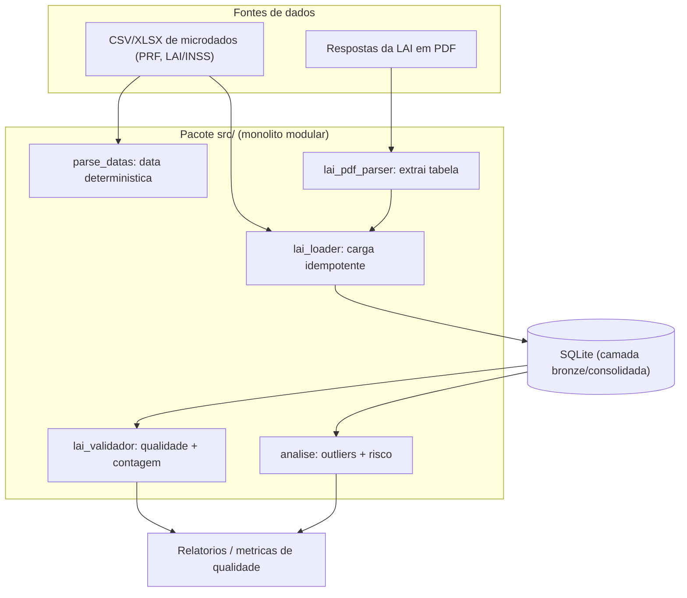
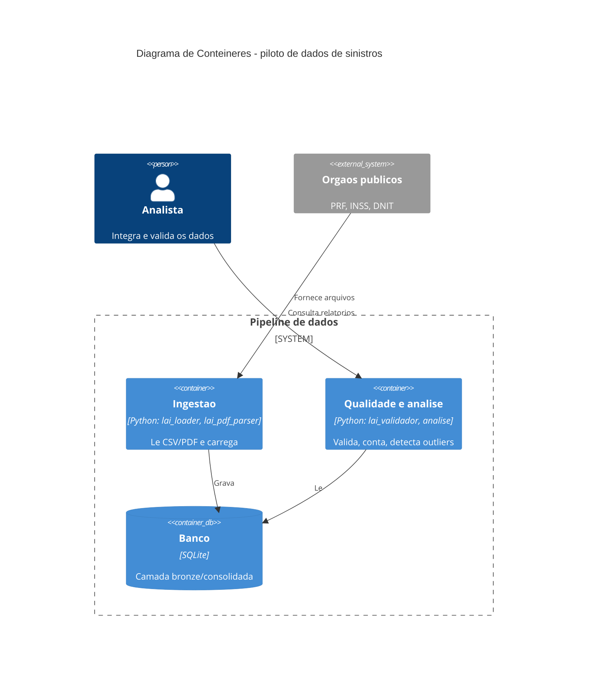

# Etapa 5 — Diagrama da arquitetura (duas versões)

A tarefa pediu gerar o diagrama da arquitetura e depois gerá-lo de uma segunda forma, comparando qual comunica melhor. As duas versões representam a mesma visão de contêiner (nível C4), com abordagens diferentes.

## Versão 1 — Fluxograma Mermaid (leve, renderiza em qualquer lugar)

## Versão 2 — C4 Container Mermaid (padrão C4, mais formal)

## Comparação

A versão 1 (fluxograma) mostra os cinco módulos individualmente e o caminho do dado, arquivo por arquivo, o que comunica melhor a granularidade real do código e renderiza sem depender de suporte a C4. A versão 2 (C4 Container) agrupa os módulos em contêineres de responsabilidade (ingestão, qualidade e banco) e explicita o ator e os sistemas externos, o que comunica melhor a intenção arquitetural para quem não vai ler o código, ao custo de esconder os módulos individuais e de exigir um renderizador com suporte a C4.

Para este projeto, a versão 1 comunica melhor no dia a dia da equipe, porque o nível de detalhe bate com o tamanho do código (cinco módulos cabem num único diagrama legível). A versão 2 seria a escolha para uma apresentação à banca ou para o artigo, onde a fronteira de responsabilidade importa mais do que o módulo específico.
